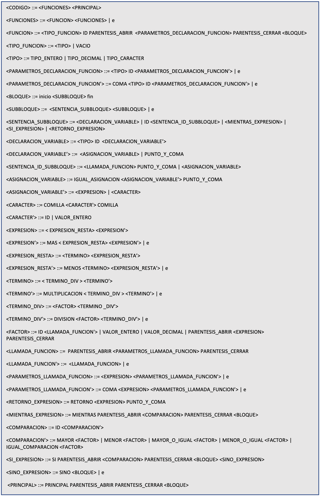

# ESPACODE language compiler

In this project we created the EspaCode programming language. It has the main aim of helping to teach programming to people who know Spanish and who do not have great technical knowledge nor fluency in English. 

With this objective, all the keywords of the language are in Spanish, and the syntax is similar to C but with a far more simple and reduced set of functionalities.

We also implemented from scratch the compiler for our newly created EspaCode language. We divided the compiler in several modules, each one managing a diferent part of the compiling process:

- Lexical analyzer

- Syntax analyzer

- Semantic analyzer

- Intermediate code generation, using TAC (3 address code) 

- Machine code generation, using MIPS (assembly-like code)

## Language features

- Typed language
- Variables (floats, chars, integers)
- Functions (with or without arguments)
- If, Else, While, For statements

## Compiler features
- Multiple lexical error detection support
- Multiple syntax error detection support, with error recovery
- Multiple semantic error detection support
- Recursion support
- TAC for intermediate code generation, MIPS for machine code generation

## Instructions

IDE used to develop and test the project:
- IntelliJ IDEA

Used libraries:
- gson-2.11.0.jar

  

The different code examples for the language can be found in the "examples" folder of the project. There are both correct examples and examples with errors.

To choose which of the code examples you want to compile, go to the "Main" class and modify the name of the file you want to compile in the "codeFilePath" variable located at line 10.

### How to test a code result once we have the generated MIPS code?
We must use a MIPS simulator like "Mars 4.5" to run the MIPS code. As no "print" function is available in the EspaCode language, the value of the register associated with the result variable has to be checked on "Mars 4.5"

https://courses.missouristate.edu/KenVollmar/MARS/download.htm

## Language grammar
The grammar of the language is LL(1), defined using the Backus-Naur form. 

## Code examples

### Fibonacci high level EspaCode code

    entero fibonacci(entero var_numero) inicio

        si(var_numero menor 2) inicio

            retorno var_numero;

        fin sino inicio

            entero resultado_fibonacci1;
            entero resultado_fibonacci2;

            entero param1;
            param1 = var_numero - 1;

            entero param2;
            param2 = var_numero - 2;

            resultado_fibonacci1 = fibonacci(param1);
            resultado_fibonacci2 = fibonacci(param2);

            retorno resultado_fibonacci1 + resultado_fibonacci2;

        fin

    fin

    principal() inicio

        entero resultado;

        resultado = fibonacci(13);

    fin

### Fibonacci TAC

    fibonacci:  
        readParam 0 t0  
        if t0 >= 2 goto L0  
        return t0  
    L0:  
        t1 = 0  
        t2 = 0  
        t3 = 0  
        t4 = t0 - 1  
        t3 = t4  
        t5 = 0  
        t6 = t0 - 2  
        t5 = t6  
        writeParam 0 t3  
        t1 = call fibonacci  
        writeParam 0 t5  
        t2 = call fibonacci  
        t7 = t1 + t2  
        return t7  

    principal:  
        t0 = 0  
        writeParam 0 13  
        t0 = call fibonacci  

### Fibonacci MIPS

The MIPS code is too large to be shown here. Compile an example code and find the file "code.asm" inside the "generatedCode" folder to see it. 

## Authors
[Pol Valero] (https://github.com/pol-valero)

[Alex Liu] (https://github.com/Alello23)